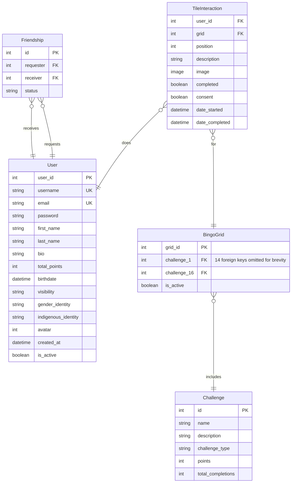

# Developer Documentation

## Tech Stack

**Frontend**

- Vue3 using the composition API.
- Vuetify.js, which is a UI Components Library for Vue
- TypeScript
- Vite
- Pinia for state management

**Backend**

- Django, using the Django REST Framework
- Postgresql for the database
- Nginx as a reverse proxy

**Linting and Formatting**

- flake8 on the backend
- ESLint for linting on the frontend
- Prettier for formatting on the frontend

**Other**

- Docker
- Poetry for python package management
- Mailgun for sending emails
- Cloudflare for providing a SSL certificate and DDoS protection
- DockerHub, a container registry
- Vercel for hosting the frontend
- Digital Ocean for hosting the backend

## Running the Website Locally

### Get Started

0. Activate the dev container in VSCode (you will first need to have installed docker and the dev container VSCode extension)
1. In the `client` folder, run `npm run dev` to start the frontend on port at `localhost:3000`
2. In the `server` folder, run `python manage.py runserver` to start the server at `localhost:8000`

> Note:
> These instructions are for if you are using the dev container (recommended).

> See the "Manual Setup" section below if you are not using the devcontainer.

### Server

#### Create and run migrations

If the models are updated, be sure to create a migration:

```bash
python manage.py makemigrations # create migration
python manage.py migrate # apply migrations
```

#### Nuke the DB

If you run into migration conflicts that you can't be bothered to fix, run `nuke.sh` to clear your database. Then, run migrations again.

### Linting and Formatting

- Linting command for the frontend: `npm run lint`

- Formatting command for the frontend: `npm run format`

- Type-checking command for the frontend: `npm run typecheck`

- Linting and formatting command for the frontend: `flake8`

### Other

#### Update Dependencies

You can run `npm install` and `poetry install` in the respective `client` and `server` folders to install the newest dependencies.

#### Editing Docker stuff

If you modify anything in the `docker` folder, you need to add the `--build` flag or Docker won't give you the latest changes.

#### Changing env vars

Edit the `.env` file in the respective directory (client or server).

### Manual Setup (for if you aren't using the devcontainer)

Setup environment variables:

1. In the `client` folder, copy the content from `.env.example` into a new file called `.env`
2. In the `server` folder, copy the content from `.env.example` into a new file called `.env`

Run the client:

1. In the `client` folder, run `npm i`
2. Run `npm run dev`

Run the database:

1. In the project root, run `docker compose up`

Run the server:

1. In the `server` folder, run `poetry install`.
2. Start the poetry shell by running `poetry shell`
3. Run migrations using `python manage.py migrate`
4. Start the server using `python manage.py runserver`
   Note: To exit the poetry shell after stopping the server, use the command `exit`

## Backend

As mentioned above, the website uses a Django backend. This section will go into some more details.

### Installed Apps

- The `rest_framework_simplejwt` plugin is used to provide authentication via JSON Web Tokens
- The `sortedm2m` is used to make it easier to implement a sorted many-to-many relationship in the models. This is used specifically so that the `BingoGrid` model can point to 16 challenges in a specific order.
- `django_q` is used to run the scheduled task of removing inactive users.

### API Endpoints

- `token/`: used to generate a JSON Web Token
- `token/refresh/`: used to generate a new access token from a refresh token
- `register/`: creates a new user from the provided information
- `update-preferences/`: updates a user's preferences
- `leaderboard/`: fetches the leaderboard
- `user/me/`: fetches information about the logged-in user
- `delete-friendship/<int:friendship_id>`: deletes the friendship with the given id
- `start-challenge/`: starts the given challenge
- `friends/all/`: gets all the friends (and friend requests) for the logged-in user
- `bingo-grid/`: fetches the currently active bingo grid
- `accept-friendship/<int:friendship_id>/`: accepts the friendship with the given id
- `get-profile-page/<str:username>/`: gets the bio and completed challenge information of the user with the provided username
- `complete-challenge/`: marks the given challenge as complete and awards the user points accordingly
- `request-friendship/<int:user_id>/`: sends a friendship request to the user with the given id
- `user-search/`: searches for users whose usernames start with the provided string
- `update-bingo-grid/`: allows admins to change the currently active bingo grid
- `email-validation/`: sends an email to the provided email with a link for the user to verify their email
- `activate/`: if the provided token is valid, mark the user as active since their email has been verified
- `request-reset/`: send an email containing a link for the user to reset their password
- `reset-password/`: change the user's password to a new one

### Entity Relationship Diagram



### Administration Commands

- In the `server` directory, run `python manage.py create_placeholder_grid` to create a placeholder grid made up of placeholder challenges.

- In the `server` directory, run `python manage.py schedule_tasks` to schedule the daily execution of a task which removes inactive users (users who have not verified their emails). This command is run automatically in production.

### Unit Tests

Unit tests have been written to test various aspects of the backend (the models, the views, ect.). These tests can be run with `python manage.py test`.

## Continuous Deployment

At the time of writing, there is a GitHub action configure to upload a docker image for the server to a container registry whenever a push to the main branch occurs. Then in the VPS, [watchtower](https://github.com/containrrr/watchtower) is used to automatically pull this image and restart the server container using the new image.
