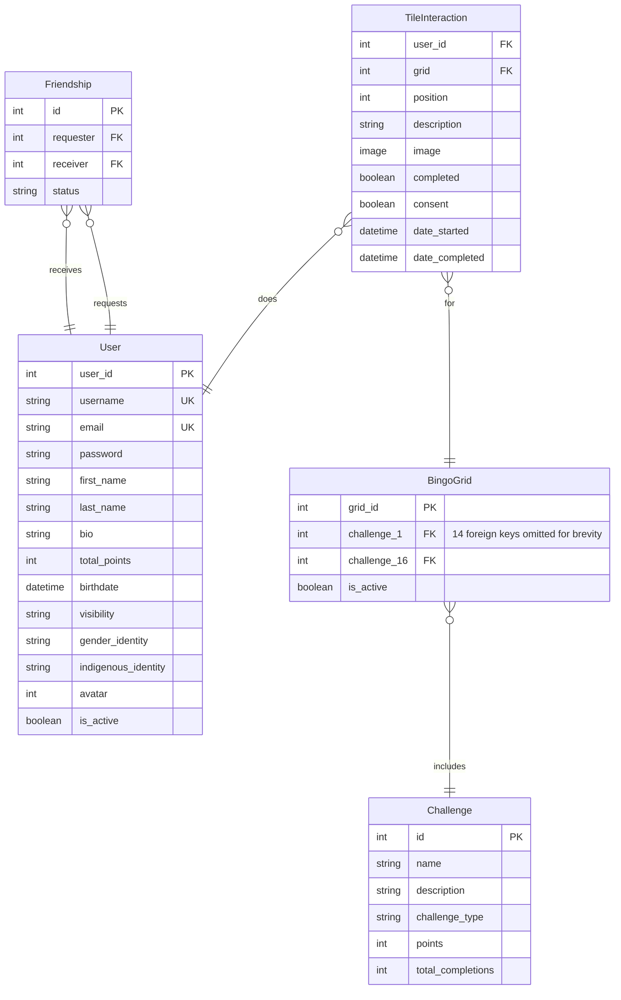

# Developer Documentation

## Tech Stack

**Frontend**

- Vue3 using the composition API.
- Vuetify.js, which is a UI Components Library for Vue
- TypeScript
- Vite
- Pinia for state management

**Backend**

- Django, using the Django REST Framework
- Postgresql for the database
- Nginx as a reverse proxy

**Linting and Formatting**

- flake8 on the backend
- ESLint for linting on the frontend
- Prettier for formatting on the frontend

**Other**

- Docker
- Poetry for python package management
- Mailgun for sending emails
- Cloudflare for providing a SSL cerficate and DDoS protection
- DockerHub, a container registry
- Vercel for hosting the frontend
- Digital Ocean for hosting the backend

## Backend

As mentioned above, the website uses a Django Backend. This section will go into some more details.

### Administration Commands

### Entity Relationship Diagram

