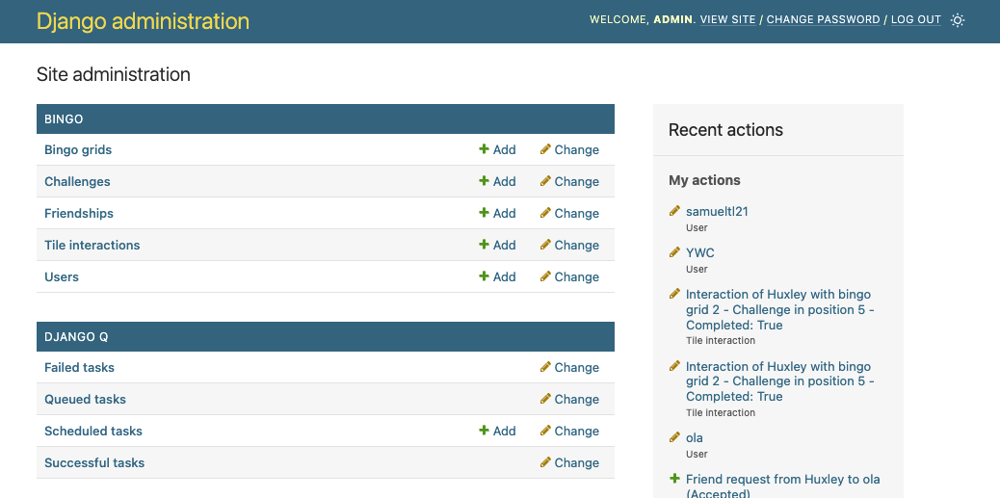
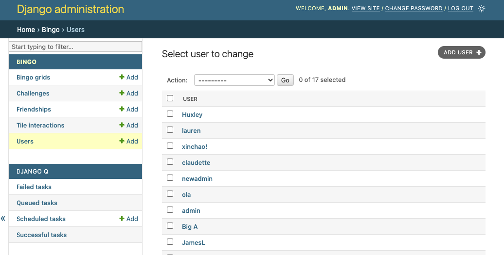
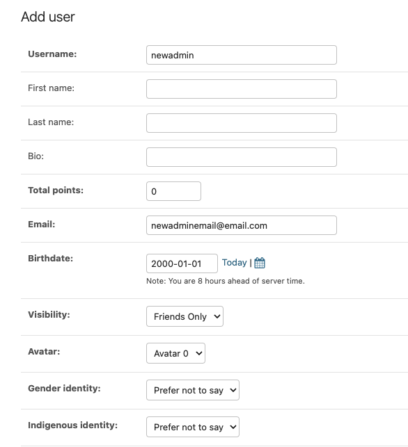
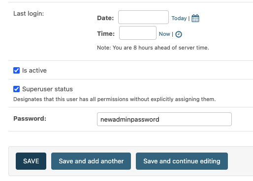
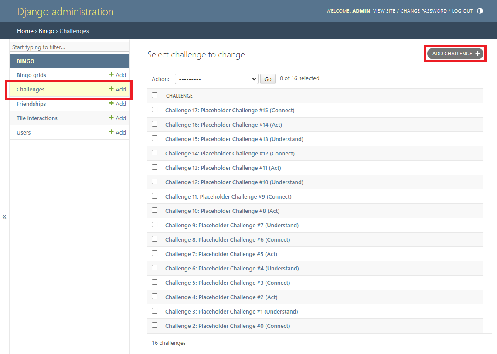
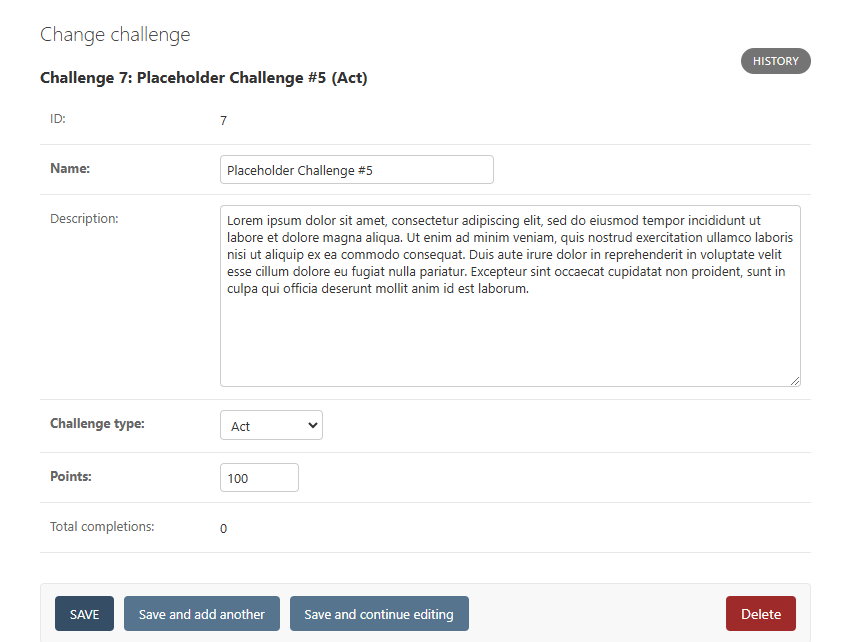
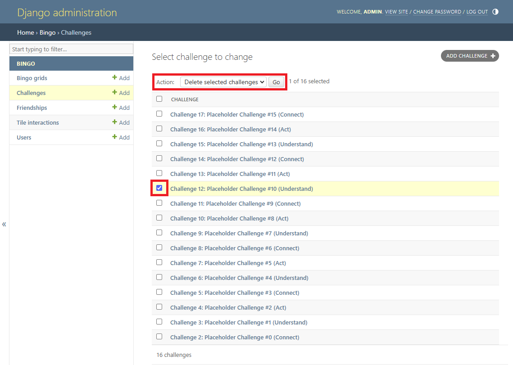
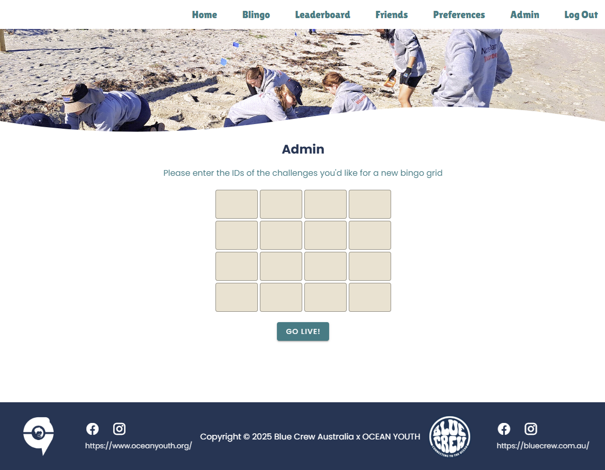
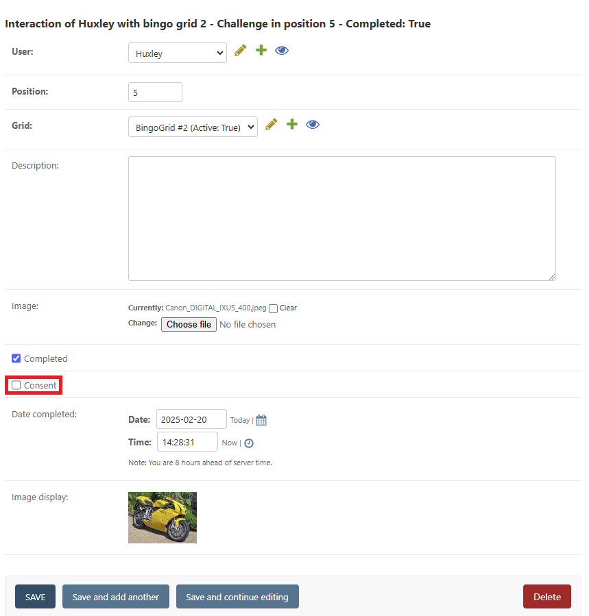
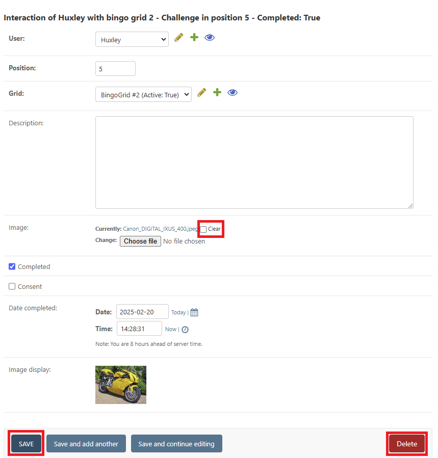

# Staff Documentation

## Admin Accounts

There are two user types: admin users and non-admin users.

Non-admin users:

- Interact with the web app as a typical user.

Admin users:

- Will not have a visible profile, and will not be visible on the leaderboard or in friend searches.

- Will have access to the admin dashboard.

- Will have access to the admin page to select active bingo grid challenges.

## Admin Dashboard

The admin dashboard is used to manage users, bingo grid challenges, and submissions. The admin dashboard can be found at https://blingo.codersforcauses.org/admin/ and all accounts with admin privileges will be able to access it. The initial admin user login details can be located in the Handover Document.

### Navigation

Upon logging in, you will be greeted with the following dashboard.

All tables from that are stored into the database used for the functionality of the website can be seen here. Not all sections will be relevant. In particular, anything under the `DJANGO Q` header can be ignored.

### Creating New Admin Accounts

1. Navigate into the Users dashboard by clicking `Users` under the BINGO header.

2. Click `ADD USER` in the top right.

3. Fill in the `Username`, `Email`, and `Password` fields. All other fields may be left blank.

4. Tick the `Superuser status` box to enable admin privileges.

5. Click `SAVE` to create the new user

Alternatively, if you would like to give an existing user admin privileges, select the user from the user list, tick the `Superuser status` box, and click `SAVE`.

## User Management

The details of both admin and non-admin users may be accessed and edited by clicking the username of the user. These details include the gender identity and indigenous identity which the user provided when signing up. Users can also be created or deleted through this page.

## Challenges

To view the database of challenges, click on the "Challenges" tab on the left. You will then be presented with a list of the challenges that have been created so far.

To create a new challenge, press the "Add Challenge" button in the top right. You can view and/or edit the details of an existing challenge by clicking on that challenge in the list of challenges. This will bring you to a form with the ability to view/modify the name, description, type, and point-value of the challenge. The challenge's ID and total number of completions by users playing the bingo game is also displayed.

To delete one or more challenges, mark the checkboxes next to the challenges you want to delete, select "Delete selected challenges" from the dropdown menu, and press the "Go" button.

## The Bingo Grid

This section will describe how to create a new bingo grid and make it active (i.e. make it be the bingo grid users will see and be able to interact with when they visit the "Blingo" page). Before creating the grid, you will first need to have created all of the challenges you wish to be part of the bingo grid (see the above section for how to do that).

To create a new bingo grid, log into the main website (<https://blingo.com.au>) using your admin account and press the admin button in the navbar to go to <https://blingo.com.au/admin>. The page should look something like this:

In each of the input boxes, input the ID of the challenge you wish to be located in that place and "Go Live!". You can refer to the admin dashboard for the IDs of the challenges. The result should be that the live bingo grid is updated.

Aside: the reason the bingo grid is updated through the main website rather than through the admin dashboard like everything else is that the interface for editing the `BingoGrid` model that comes with Django via its admin dashboard is not at all user friendly. Thus, a custom interface has been made on the frontend for this task of updating the active bingo grid.

## User Submissions

### Viewing submissions

You can view the interactions between users and challenges by clicking on the "Tile Interactions" tab.

Clicking on a particular tile interaction will bring up a display like below. If the challenge has been completed, a display of the image the user uploaded will be shown at the bottom. The "Consent" checkbox indicates whether the user has given consent for this image to be shared on social media.

If you just want to see the submissions of a particular user, this can be done from the main website by navigating to "https://blingo.com.au/profile?username={username}", where "{username}" is replaced by the username of that particular user (you may need to be logged in as the admin account).

### Revoking submissions

If you wish to revoke a user's submission, you can do so by pressing the delete button. The submission will then no longer be visible in the user's profile page. Alternatively, if you just wish to delete the image the user uploaded, then you can mark the "Clear" checkbox within the image field and press the "Save" button.

