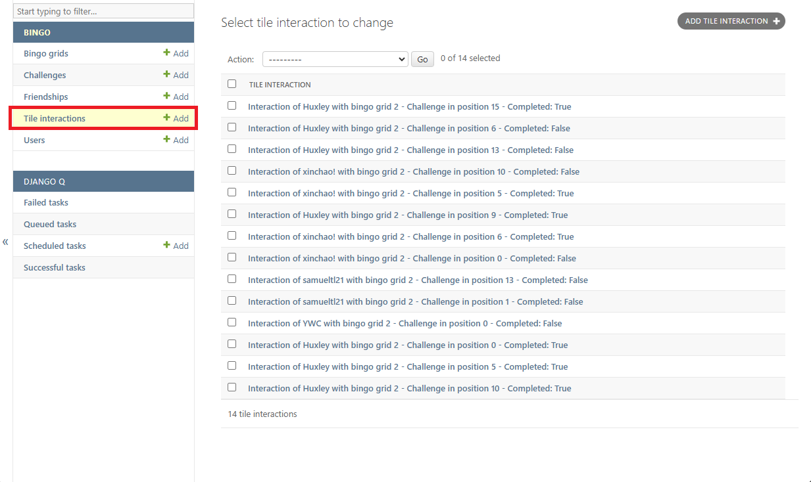

# Staff Documentation

## Admin Dashboard

Lorem ipsum dolor sit amet, consectetur adipiscing elit, sed do eiusmod tempor incididunt ut labore et dolore magna aliqua. Ut enim ad minim veniam, quis nostrud exercitation ullamco laboris nisi ut aliquip ex ea commodo consequat. Duis aute irure dolor in reprehenderit in voluptate velit esse cillum dolore eu fugiat nulla pariatur. Excepteur sint occaecat cupidatat non proident, sunt in culpa qui officia deserunt mollit anim id est laborum.

### Access

Lorem ipsum dolor sit amet, consectetur adipiscing elit, sed do eiusmod tempor incididunt ut labore et dolore magna aliqua. Ut enim ad minim veniam, quis nostrud exercitation ullamco laboris nisi ut aliquip ex ea commodo consequat. Duis aute irure dolor in reprehenderit in voluptate velit esse cillum dolore eu fugiat nulla pariatur. Excepteur sint occaecat cupidatat non proident, sunt in culpa qui officia deserunt mollit anim id est laborum.

### Creating New Staff Accounts

Lorem ipsum dolor sit amet, consectetur adipiscing elit, sed do eiusmod tempor incididunt ut labore et dolore magna aliqua. Ut enim ad minim veniam, quis nostrud exercitation ullamco laboris nisi ut aliquip ex ea commodo consequat. Duis aute irure dolor in reprehenderit in voluptate velit esse cillum dolore eu fugiat nulla pariatur. Excepteur sint occaecat cupidatat non proident, sunt in culpa qui officia deserunt mollit anim id est laborum.

## User Management

Lorem ipsum dolor sit amet, consectetur adipiscing elit, sed do eiusmod tempor incididunt ut labore et dolore magna aliqua. Ut enim ad minim veniam, quis nostrud exercitation ullamco laboris nisi ut aliquip ex ea commodo consequat. Duis aute irure dolor in reprehenderit in voluptate velit esse cillum dolore eu fugiat nulla pariatur. Excepteur sint occaecat cupidatat non proident, sunt in culpa qui officia deserunt mollit anim id est laborum.

## The Bingo Grid

Lorem ipsum dolor sit amet, consectetur adipiscing elit, sed do eiusmod tempor incididunt ut labore et dolore magna aliqua. Ut enim ad minim veniam, quis nostrud exercitation ullamco laboris nisi ut aliquip ex ea commodo consequat. Duis aute irure dolor in reprehenderit in voluptate velit esse cillum dolore eu fugiat nulla pariatur. Excepteur sint occaecat cupidatat non proident, sunt in culpa qui officia deserunt mollit anim id est laborum.

## Challenges

To view the database of challenges, click on the "Challenges" tab on the left. You will then be presented with a list of the challenges that have been created so far.

To create a new challenge, press the "Add Challenge" button in the top right. You can view and/or edit the details of an existing challenge by clicking on that challenge in the list of challenges. This will bring you to a form with the ability to view/modify the name, description, type, and point-value of the challenge. The challenge's ID and total number of completitions by users playing the bingo game is also displayed.

To delete one or more challenges, mark the checkboxes next to the challenges you want to delete, select "Delete selected challenges" from the dropdown menu, and press the "Go" button.

## User Submissions

### Viewing submissions

You can view the interactions between users and challenges by clicking on the "Tile Interactions" tab.

Clicking on a particular tile interaction will bring up a display like below. If the challenge has been completed, a display of the image the user uploaded will be shown at the bottom. The "Consent" checkbox indicates whether the user has given consent for this image to be shared on social media.

If you just want to see the submissions of a particular user, this can be done from the main website by navigating to "https://blingo.com.au/profile?username={username}", where "{username}" is replaced by the username of that particular user (you may need to be logged in as the admin account).

### Revoking submissions

If you wish to revoke a user's submission, you can do so by pressing the delete button. The submission will then no longer be visible in the user's profile page. Alternatively, if you just wish to delete the image the user uploaded, then you can mark the "Clear" checkbox within the image field and press the "Save" button.

